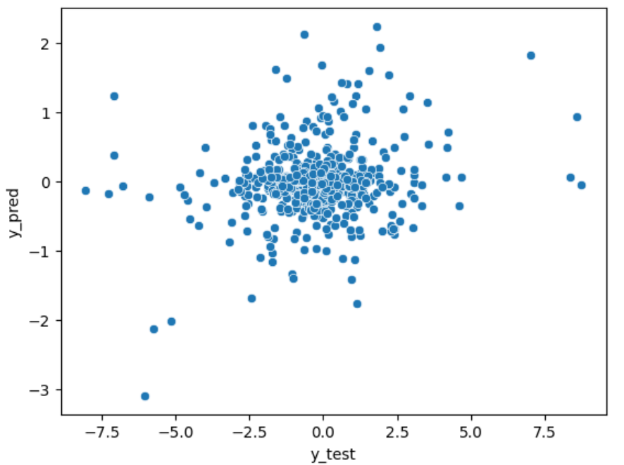

<div align="center">

# This is a tutorial for $\color{#1DADFF}Machine \space Leraning$ algorithms


 
# $\color{red}Hello \space \color{lightblue}and \space \color{orange}Wellcome$
# $\color{red}WARNING$ : DO NOT USE THESE IN REAL MARKET
</div>

## In this Package we try input data from stock markets and evaluate some of the machine learnings models
<br/>
(for Now and later maybe we add other options )

<br/>

## Using this Package is too easy:
+ Befor use you should know--> [how can read and input data](https://github.com/Masoud-Khosravi/Stock-Markets)
<br/>

# In this Learnings we study some models of supervised learning
+ Classification
+ Regression 
</br>

# we study this models in Classification
+ TensorFlow
+ Random Forest
+ Ada Boost
+ K-Nearest Neighbors
+ Decision Trees
+ Support Vector Machines

# And  we study this models in Regression
+ TensorFlow
+ Support Vector Regression
+ Decision Tree Regression
+ ridge Regression
<br/>
<br/>

# and in here I put some codes to show how its work:
+ [Classification](Classifications%20Test.ipynb)
+ [Regression](Regression%20Test.ipynb)

<br/>
<br/>

# Now --> The first step is -> Read the data
## We have already made this function 
## Read More: [Stock Markets](https://github.com/Masoud-Khosravi/Stock-Markets)
   
## Example:
```python
from ReadData import MetaTrader
df_raw=my_obj.df_type1_raw
df_raw.tail()
```


<br/>
<br/>

# Example for Classification: it's time to make y_values
## at this part we create the y values
### we calculate stop loss in each candles close price based on low26/high26
### <low26: for buy signals & high26: for sell signals>
### and we set take profit at least twice (means TP>=2*SL)        
### Then we give time to the program: in this section time is equal to 24 candles
### Means: this model must take profit before reaching the stop loss in maximum 24 candles
###  So 
+ if it is profitable in sell means our signal should be 'Sell'
+ if it is profitable in buy means our signal should be 'Buy'
+ if the model does not take profit in any of them before reaching the stop loss
--> our signal is 'Nothing' in that candles close time
## we show:
+ buy signals by->1
+ sell signals by->2
+ and Do Nothings by->0

## lets go 
```python
def create_y(dataframe):
    """
    Please pass your raw dataframe
    """
    df=dataframe.copy()
    #create an empty y values
    y=pd.DataFrame(np.nan,index=np.arange(len(df)),columns=["y_true"])
    
    # in this part from time the only thing that matters to us is the hour
    df['time'] = df['time'].apply(lambda num: num.hour)
    for pos in np.arange(0, len(df)):
        close_price = df.loc[pos, 'close']
        # calculate distance of stop loss and create tp points
        sl_buy = close_price-df.loc[pos, 'Low26']
        sl_sell = df.loc[pos, 'High26']- close_price
        
        tp_buy = sl_buy * 2.1
        tp_sell = sl_sell * 2.1
        signal = 0 # default signal is Zero (do nothing)        
        # we don't trade after 11 p.m until 4 a.m menas in this hour signals should be Zero
        if (df.loc[pos, 'time'] < 23) and (df.loc[pos, 'time'] > 4):
            for last in np.arange(1, 25):# This is the part where we give maximum time to the model: 24 candles
                if (pos + last) < len(df):
                    high_last = df.loc[pos + last, 'High26'] - close_price
                    low_last = close_price- df.loc[pos + last, 'Low26']
                    low_now = close_price- df.loc[pos + last, 'low']
                    high_now = df.loc[pos + last, 'high'] - close_price
                    if (low_last <= sl_buy) and (high_now > tp_buy):
                        signal = 1
                        break
                    elif (high_last <= sl_sell) and (low_now > tp_sell):
                        signal = 2
                        break
        y.loc[pos] = signal
    return y
```
```python
y=create_y(df_raw)
```
```python
from Learnings import Classifications
```
## After we create y we pass normalized dataframe to models
### So we have normalized df:
```python
df = my_obj.df_type1_changed
y = pd.to_numeric(y['y_true'], downcast='integer')
Class_obj = Classifications(df,y)
```
# Let's check the models:
```python
model = Class_obj.tensorflow()
Class_obj.evaluates.plot_confusion_matrix()
```
```python
model = Class_obj.random_forest()
Class_obj.evaluates.plot_confusion_matrix()
```

## As you can see we have one new row in evaluation!
## Yes that is <Final Score> So What is it ?
## As you know 
+ when our model predict 0 mean no signal --> We don't lose money AND We don't earn money
+ when our model predict 1 or 2 --> We have Buy/Sell signal 
    + if we loss --> we lose money by stop loss (SL)
    + if we won --> we earn money by take profit (TP>2*SL)

## So --> How Calculate final Score ?
+ 0-> No Signal -> No Point
+ 1/2 (Buy/Sell) if it was True --> We GET 2 Point (2*SL)
+ 1/2 (Buy/Sell) if it was False --> We LOSE 1 point (SL)
    + Final Score= True Signals*2 - False Signal
#
<br/>
<br/>

# Now let's see an example for Regression:
## after reading data we should make y_values
## in this part we create the y values
### our y values in this case is The closing price of the next candle
### and for best selection we use distance of next close price vs current close price
###  this_close - next_close  --> So 
+ if distance is positive means next candle is lower than this candle As long as the distance
+ if distance is negative means next candle is upper than this candle As long as the distance

## lets go
```python
def create_y(dataframe):
    """
    Please pass your raw dataframe
    """
    df=dataframe.copy()
    y = df.apply(lambda row: df["close"][row.name]-df["close"][row.name+1] 
                                if row.name<(len(df)-1) else np.nan,axis=1)
    return y
```
## now we can visulize data


## after cleaning and organizing dataframe we plot again:

#
# Let's check some models:
```python
from Learnings import Regression
model = Class_obj.tensorflow()
Class_obj.evaluates.mean_errors()
```

```python
Class_obj.evaluates.plot_df_y()
```


## and we can see Some or All predicts:
```python
df_y[df_y['y_pred']<=-2]
```


# as you can See it's not bad and you can see all steps here:

+ [Classification](Classifications%20Test.ipynb)
+ [Regression](Regression%20Test.ipynb)

<br/>
<br/>

## And Final Note : 
## Never use this functions for Trade, These are only educational
<br/>
<br/>
<br/>
<br/>

### under development ... < we will come back soon >

<br/>

## Other Repositories:
[](https://github.com/Masoud-Khosravi/SQL-Python)
[](https://github.com/Masoud-Khosravi/Tensorflow-Covid-19)

[](https://github.com/Masoud-Khosravi/Machine-Learning)
[](https://github.com/Masoud-Khosravi/Stock-Markets)

<br/>
<br/>
<div align="left">

## $\color{red}About \space \color{orange}Me:$
<a href="https://github.com/Masoud-Khosravi">
  
</a>
<br/>
<br/>

</div>
<p align="center">
  <br/>
  <a href="https://www.linkedin.com/in/masoudkhosravi/">
      
  </a>
  <a href="mailto:masoudkh.new@gmail.com">
      
  </a>
  <a href="https://github.com/Masoud-Khosravi">
     
  </a>
  <br/>
  <a href="https://github.com/Masoud-Khosravi">
       
  <!---  
      
  -->
    
  </a>
  
</p>
